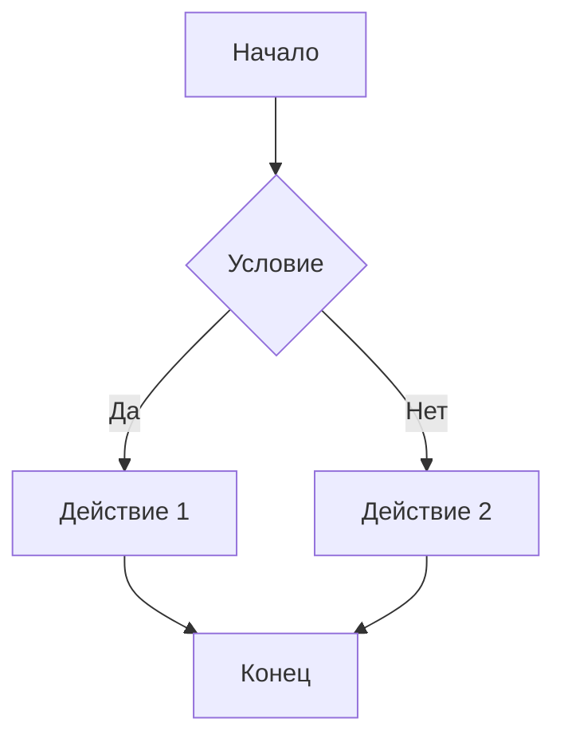
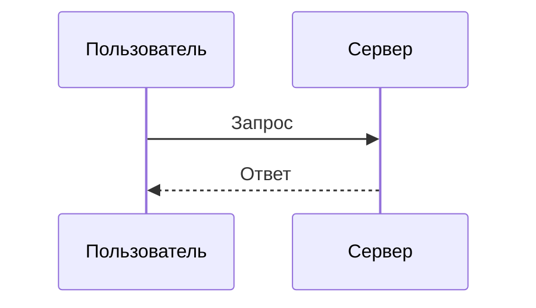

# Mermaid.js транспилированный для 1С

Этот проект транспилирует Mermaid.js версии 11.12.2 в ES5-совместимый код для использования в старом WebKit платформы 1С.

## 📋 Описание

Mermaid.js - это популярная библиотека для создания диаграмм и графиков с помощью текстового синтаксиса. Однако современные версии Mermaid используют ES6+ функции, которые не поддерживаются в старых браузерах, включая встроенный WebKit платформы 1С.

Этот проект решает проблему, транспилируя Mermaid.js в ES5 и упаковывая все зависимости в один файл, готовый к использованию в 1С.

## 🚀 Быстрый старт

### Шаг 1: Установка Node.js

Если у вас еще не установлен Node.js:
1. Скачайте Node.js с официального сайта: https://nodejs.org/
2. Установите версию LTS (рекомендуется)
3. Проверьте установку, открыв терминал и выполнив:
   ```bash
   node --version
   npm --version
   ```

### Шаг 2: Установка зависимостей

Откройте терминал в папке проекта и выполните:

```bash
npm install
```

Эта команда установит все необходимые библиотеки для транспиляции.

### Шаг 3: Сборка проекта

Выполните команду сборки:

```bash
npm run build
```

После успешной сборки в папке `dist/` появится файл `mermaid_all_in_one.js` - это готовый к использованию файл со всеми зависимостями и полифиллами.

**Важно**: Для обхода кэша браузера рекомендуется создать версионированную копию файла:
```bash
cp dist/mermaid_all_in_one.js dist/mermaid_all_in_one_v11.12.2.js
```

### Шаг 4: Использование в HTML

1. Скопируйте файл `dist/mermaid_all_in_one_v11.12.2.js` (или `mermaid_all_in_one.js`) в нужную папку вашего проекта
2. Используйте файл `Просмотр Mermaid схем all in one.html` как пример использования
3. Откройте HTML файл в браузере или встроенном браузере 1С

**Примечание**: В примере HTML файла используется версионированный файл `mermaid_all_in_one_v11.12.2.js` для обхода кэша браузера.

## 📁 Структура проекта

```
MermaidTo1C/
├── src/                          # Исходные файлы
│   ├── index.js                 # Точка входа для сборки (импорт и инициализация Mermaid + ELK)
│   └── polyfills.js             # Импорт полифиллов (core-js, regenerator-runtime)
├── dist/                         # Собранные файлы (создается после сборки)
│   ├── mermaid_all_in_one.js    # Основной собранный файл
│   └── mermaid_all_in_one_v11.12.2.js  # Версионированный файл (для обхода кэша)
├── Просмотр Mermaid схем all in one.html  # Пример использования в HTML
├── rollup.config.js             # Конфигурация сборщика Rollup
├── .babelrc                      # Конфигурация транспиляции Babel (ES5 для IE 11)
├── .gitignore                   # Игнорируемые файлы для Git
├── package.json                 # Зависимости и скрипты проекта
└── README.md                     # Этот файл
```

**Примечание**: Папка `dist/` создается автоматически при первой сборке. Файлы в ней можно коммитить в репозиторий для удобства использования без необходимости сборки.

## 🔧 Доступные команды

- `npm install` - установка всех зависимостей проекта
- `npm run build` - сборка проекта (создает `dist/mermaid_all_in_one.js`)
- `npm run build:watch` - сборка в режиме наблюдения (автоматически пересобирает при изменениях)

## 💻 Использование в HTML

### Минимальный пример

```html
<!DOCTYPE html>
<html lang="ru">
<head>
    <meta charset="UTF-8">
    <title>Mermaid Диаграммы</title>
</head>
<body>
    <!-- Критически важные полифиллы - должны быть ДО загрузки mermaid -->
    <script>
        // Полифилл для Object.hasOwn (ES2022)
        if (typeof Object.hasOwn === 'undefined') {
            Object.hasOwn = function(obj, prop) {
                return Object.prototype.hasOwnProperty.call(obj, prop);
            };
        }
        
        // Полифилл для Array.prototype.at() (ES2022)
        if (!Array.prototype.at) {
            Array.prototype.at = function(index) {
                var len = this.length;
                var relativeIndex = index >= 0 ? index : len + index;
                if (relativeIndex < 0 || relativeIndex >= len) {
                    return undefined;
                }
                return this[relativeIndex];
            };
        }
        
        // Полифилл для SVGElement.getBBox() (для старых браузеров)
        // ... (см. полный пример в Просмотр Mermaid схем all in one.html)
    </script>
    
    <!-- Диаграмма -->
    <pre class="mermaid">
graph TD
    A[Начало] --> B[Процесс]
    B --> C[Конец]
    </pre>

    <!-- Подключение транспилированного Mermaid -->
    <script src="dist/mermaid_all_in_one_v11.12.2.js"></script>
    
    <script>
        // Mermaid автоматически обработает все элементы с классом .mermaid
        // При необходимости можно вызвать вручную:
        if (window.mermaid && window.mermaid.run) {
            window.mermaid.run();
        }
    </script>
</body>
</html>
```

**Важно**: Полифиллы должны быть загружены ДО загрузки основного скрипта Mermaid. Полный пример с всеми необходимыми полифиллами смотрите в файле `Просмотр Mermaid схем all in one.html`.

### Поддерживаемые типы диаграмм

- **Flowchart (граф)**: `graph TD` или `graph LR`
  - **С прямоугольными стрелками**: `flowchart-elk TD` (использует ELK для orthogonal connectors)
- **Sequence Diagram**: `sequenceDiagram`
- **Gantt Chart**: `gantt`
- **Class Diagram**: `classDiagram`
- **State Diagram**: `stateDiagram-v2`
- И другие типы, поддерживаемые Mermaid 11.12.2

**Примечание**: ELK встроен в бандл, поэтому диаграммы с прямоугольными соединительными линиями работают без динамической загрузки модулей.

## 🛠️ Технические детали

### Транспиляция

- **Целевая версия**: ES5 (совместимость с IE 11 и старыми браузерами)
- **Инструменты**: Rollup + Babel
- **Полифиллы**: Включены автоматически для:
  - `Object.hasOwn` (ES2022)
  - `Array.prototype.at()` (ES2022)
  - `SVGElement.getBBox()` (для старых браузеров)
  - `Object.assign`, `Array.from`, `Array.includes`, `String.includes`
  - `structuredClone`
- **ELK (Eclipse Layout Kernel)**: Встроен в бандл для поддержки прямоугольных соединительных линий

### Размер файла

Собранный файл `mermaid_all_in_one.js` имеет размер примерно 8.2 МБ (несжатый). Это нормально, так как включает:
- Mermaid.js 11.12.2
- ELK (Eclipse Layout Kernel) для прямоугольных соединительных линий
- Все зависимости (D3, dagre, cytoscape, elkjs и др.)
- Полифиллы для старых браузеров

### ELK (Eclipse Layout Kernel)

ELK встроен в бандл для поддержки прямоугольных соединительных линий (orthogonal connectors) в flowchart-диаграммах. В Mermaid v11 ELK был вынесен в отдельный пакет `@mermaid-js/layout-elk` и загружается динамически, но для старых браузеров (WebKit 1С) он встроен в бандл.

**Использование ELK:**
- Для использования ELK в диаграмме, укажите `flowchart-elk` вместо `flowchart` или `graph`
- Или установите `defaultRenderer: 'elk'` в конфигурации Mermaid
- Пример: `flowchart-elk TD` или `graph TD` с настройкой `flowchart: { defaultRenderer: 'elk' }`

## ⚠️ Важные замечания

1. **Версионирование файлов**: После сборки рекомендуется создать версионированную копию файла (например, `mermaid_all_in_one_v11.12.2.js`) для обхода кэша браузера. Это особенно важно при разработке.

2. **Кодировка**: Убедитесь, что HTML файл сохранен в кодировке UTF-8 для корректного отображения кириллицы и других Unicode символов.

3. **Полифиллы**: Полифиллы **критически важны** и должны быть загружены ДО выполнения кода Mermaid. В примере HTML файла они включены в начале страницы перед загрузкой основного скрипта.

4. **Совместимость**: Протестировано для работы в старом WebKit платформы 1С. Также должно работать в IE 11 и других старых браузерах.

5. **Размер файла**: Собранный файл имеет размер около 8.2 МБ (несжатый). Это нормально, так как включает всю библиотеку Mermaid, ELK для прямоугольных соединительных линий и все зависимости.

## 🐛 Решение проблем

### Диаграммы не отображаются

1. **Откройте консоль браузера** (F12 или Правой кнопкой → Inspect → Console) и проверьте на наличие ошибок
2. Убедитесь, что файл `mermaid_all_in_one_v11.12.2.js` загружен корректно (проверьте вкладку Network в DevTools)
3. Проверьте, что элементы имеют класс `.mermaid`
4. Убедитесь, что синтаксис диаграммы корректен (можно проверить на https://mermaid.live/)
5. Проверьте, что полифиллы загружены ДО основного скрипта

### Ошибка "Object.hasOwn is not a function"

**Решение**: Убедитесь, что полифилл для `Object.hasOwn` загружается ДО загрузки основного скрипта Mermaid. Полифилл должен быть в `<script>` теге перед `<script src="dist/mermaid_all_in_one_v11.12.2.js"></script>`.

### Ошибка "getBBox is not a function"

**Решение**: Полифилл для `SVGElement.getBBox()` должен быть загружен. Проверьте, что он включен в HTML файл перед загрузкой основного скрипта. Полный пример смотрите в `Просмотр Mermaid схем all in one.html`.

### Ошибка "Array.prototype.at is not a function"

**Решение**: Убедитесь, что полифилл для `Array.prototype.at()` загружен. Этот метод используется в Mermaid 11.x и не поддерживается в старых браузерах.

### Диаграмма отображается не полностью

1. Проверьте, что все полифиллы загружены
2. Убедитесь, что нет ошибок в консоли
3. Проверьте синтаксис диаграммы на https://mermaid.live/
4. Попробуйте очистить кэш браузера (Ctrl+Shift+Delete или Cmd+Shift+Delete)

## 📝 Примеры диаграмм

### Flowchart (Граф)



### Sequence Diagram (Диаграмма последовательности)



### Другие типы

Поддерживаются все типы диаграмм, доступные в Mermaid 11.12.2. Полный список и синтаксис смотрите на [официальном сайте Mermaid](https://mermaid.js.org/intro/).

## 📝 Лицензия

MIT

## 🙏 Благодарности

- [Mermaid.js](https://mermaid.js.org/) - за отличную библиотеку для создания диаграмм
- [Rollup](https://rollupjs.org/) - за инструмент сборки
- [Babel](https://babeljs.io/) - за транспиляцию кода

## 📞 Поддержка

Если у вас возникли проблемы:
1. Проверьте раздел "Решение проблем" выше
2. Убедитесь, что вы следуете инструкциям из раздела "Быстрый старт"
3. Проверьте, что все полифиллы загружены правильно
4. Откройте консоль браузера и проверьте наличие ошибок
